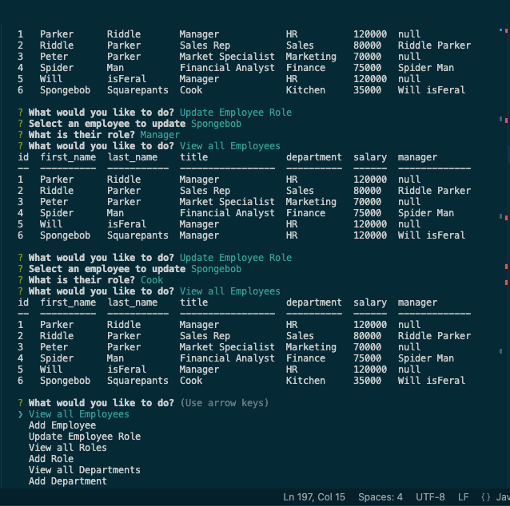

# Employee-Listing-System


## Description

```md
AS A business owner
I WANT to be able to view and manage the departments, roles, and employees in my company
SO THAT I can organize and plan my business
```

## Table of Contents

- [Installation](#installation)
- [Usage](#usage)
- [Credits](#credits)
- [License](#license)

## Installation

The first step is to get into mysql. Then you want to SOURCE the schema and seeds file (in that order). You can go into the main branch now and run npm start. This will start the application in your console and you'll be able to answer the prompts to fill out/display the tables.

## Usage

Follow steps for installation and follows prompts to your desire



[Screen recording of using file](https://drive.google.com/file/d/1PGJ_1JM-ED4bz-BV3j6UuUFvd0t3kAOx/view?usp=sharing "Screen recording of using file")

## License

MIT

## Contributing

I used too many too list. MDN is a great resource as well ads this past week's assignments. Google was a great tool that I love to use as well.

## Questions

GitHub username: Priddle88

GitHub profile: [Link to Profile](https://github.com/Priddle88)

Reach out to parkerriddle09@gmail.com (with your first name included) if you have any questions!
